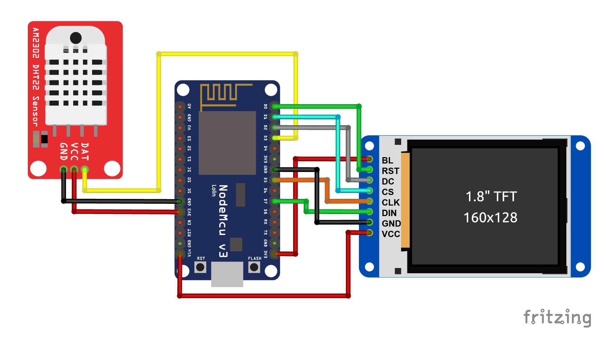

# Wifi - temperature - sensor with board ESP8266

This program runs on an ESP8266 microcontroller and is designed to:

    Connect to Wi-Fi: It starts by connecting the ESP8266 to a specified Wi-Fi network using the provided SSID and password.

    Sync Time with NTP Server: After the Wi-Fi connection is established, the code synchronizes the device's internal clock with an NTP (Network Time Protocol) server, specifically "pool.ntp.org". This ensures that the ESP8266 has the correct time based on the UTC offset set for the user's time zone (e.g., Eastern Standard Time - EST).

    Fetch Weather Data: Once the time is synced, the program makes an HTTP GET request to the OpenWeatherMap API to retrieve weather information for a specified city (in this case, Montreal). It uses a provided API key and sets the unit of temperature to Celsius.

    Parse and Display Weather Information: The response from the weather API is in JSON format, and the code parses this data to extract the temperature and humidity. The extracted data is then printed to the Serial Monitor for the user to see.

    Display the Current Time: The current time, which was synchronized from the NTP server, is also printed to the Serial Monitor.

    Repeat Every 10 Minutes: After displaying the weather data and time, the program waits for 10 minutes before making another request to fetch the latest weather data. This cycle repeats indefinitely.

Main Steps:

    Wi-Fi Connection: Connects to a specified Wi-Fi network.
    Time Sync: Fetches the current time from an NTP server.
    Weather Fetching: Requests weather data from OpenWeatherMap using the city and API key.
    Data Parsing: Parses the returned JSON data to extract and display temperature and humidity.
    Time Display: Shows the synchronized time.
    Delay: Waits for 10 minutes before repeating the process.

Purpose:

This project could be used for applications like weather stations, IoT projects, or any device that requires fetching weather data and time on a regular basis, such as for display on a dashboard or for logging purposes.
